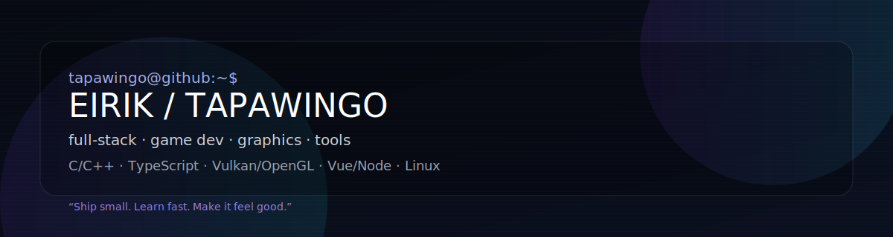
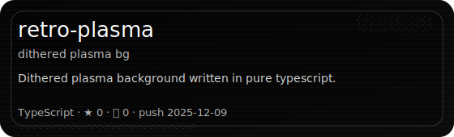
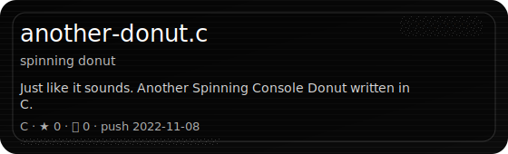
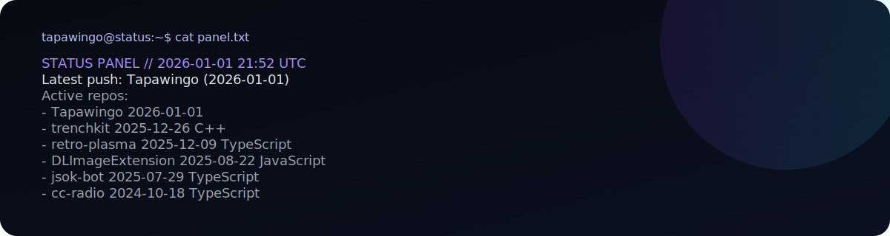

<p align="center">
  
</p>

<p align="center">
  <a href="https://eirik.dalseggteppen.no">
    
  </a>
  <a href="https://github.com/Tapawingo?tab=repositories">
    
  </a>
  
</p>

<p align="center">
  <b>full-stack · game dev · graphics · tools</b><br/>
  C/C++ · TypeScript · Vulkan/OpenGL · Vue/Node · Linux
</p>

### `whoami`
```txt
Eirik ("Tapawingo")
Software & Game Development @ NTNU 🇳🇴
modding/tooling • graphics APIs • terminal art • clean UI
```

### Featured builds
<table>
<tr>
  <td width="50%"><a href="https://github.com/Tapawingo/trenchkit"></a></td>
  <td width="50%"><a href="https://github.com/Tapawingo/retro-plasma"></a></td>
</tr>
<tr>
  <td width="50%"><a href="https://github.com/Tapawingo/DLImageExtension"></a></td>
  <td width="50%"><a href="https://github.com/Tapawingo/another-donut.c"></a></td>
</tr>
</table>

### Status panel (custom widget)
<p align="center">
  
</p>

### Ping me
- https://eirik.dalseggteppen.no
- https://github.com/Tapawingo
