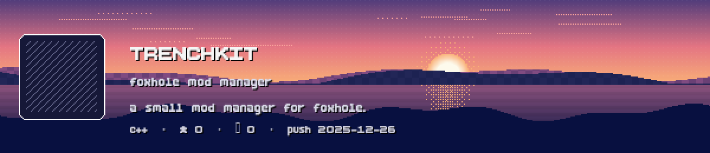
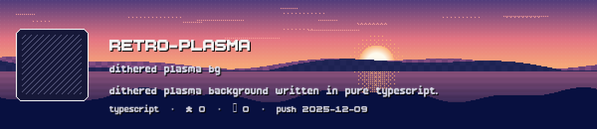
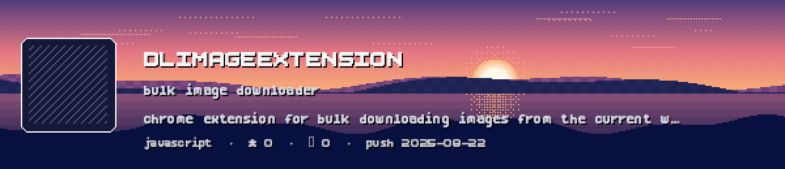
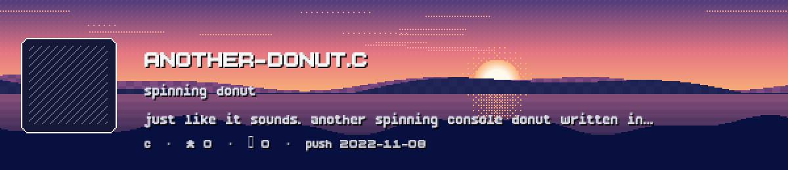

  

  
  
  

  <b>full-stack · game dev · graphics · tools</b> 
  C/C++ · TypeScript · Vulkan/OpenGL · Vue/Node · Linux

<table>
<tr>
  <td>
    
  </td>
  <td>
    <h2>Featured Projects</h2>  
    
    
    
    
  </td>
</tr>
</table>

### Featured builds
<table>
<tr>
  <td width="50%"></td>
  <td width="50%"></td>
</tr>
<tr>
  <td width="50%"></td>
  <td width="50%"></td>
</tr>
</table>

---
 

  
  
  
  

